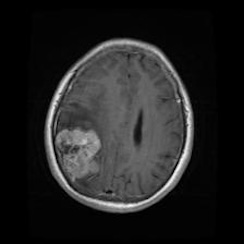
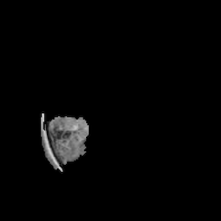
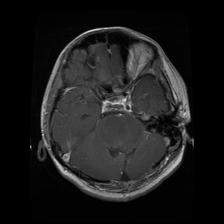
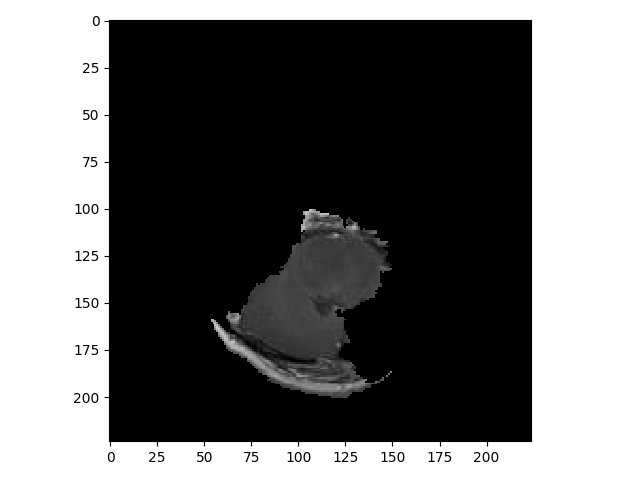

# Tumors

## Anchoring Successes

When the model was correct, anchoring was quite effective at finding the tumor in the image that caused the model's prediction. In the figure below, anchoring was able to locate the tumor quickly (in under five seconds, which is on the order of 100 times faster than in the animal dataset), which is important for its practical use. Tumor recognition is also a reasonably well-researched field with models that work significantly better than ours (need citation), which would only improve anchoring's speed and effectiveness.

## Anchoring Failures

The superpixelation algorithm used behind anchoring is still a liability. For the MRI below, the anchor is fairly large, but the actual tumor is a small white ellipse on the very left side of the anchor. If superpixelation algorithms cannot give tumors their own superpixels, anchors will include extraneous parts of the brain, which reduces its effectiveness considerably. 

Another issue is that the anchoring package displays its explanations by showing only the anchors and blacking out the rest of the image, which can be disorienting and take away necessary context, especially when images are black and white like these MRIs. This can be resolved since it is an issue with the anchoring package, not the explanatory technique itself, but it reduces the practicality of using anchors in this domain.
