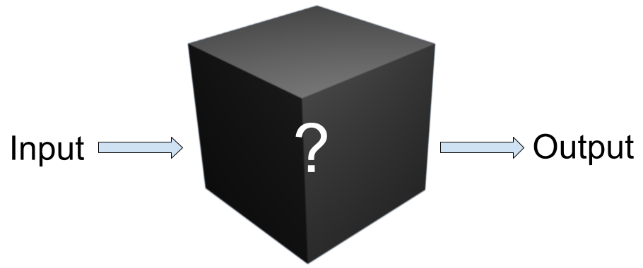

# What is XAI?


Why should you trust Machine Learning (ML)? Headlines are filled with [fundamental flaws in machine learning models published by technology giants](https://www.nytimes.com/2023/05/22/technology/ai-photo-labels-google-apple.html).


Most real world applications lean away from inherently explainable models like decision trees or linear regression models, and towards black box models like neural networks due to their complex and robust hypothesis spaces, which allows them to perform better in most cases of complex relationships.

This page introduces the need for explainable AI (XAI) techniques. Explainable AI techniques attempt to illustrate how a machine learning model comes to a conclusion.


## Why XAI Matters
We are living through a revolution of the standards for ethical machine learning practices which has been thoroughly marked by the need to explain artificial intelligences — namely their predictions. As discussed in Ribeiro et al. [(2016, p.1)](https://arxiv.org/abs/1602.04938), the act of explaining an AI’s prediction presents the audience with visualizations pertaining to the actions it made to achieve such a decision, thus building users’ trust in the model and exposing any possible errors in the model’s structure.

### Legal Implications
With regulations like the EU’s [Right to Explainability](https://www.europarl.europa.eu/news/en/press-room/20231206IPR15699/artificial-intelligence-act-deal-on-comprehensive-rules-for-trustworthy-ai) and the United States’ proposed [AI Bill of Rights](https://www.whitehouse.gov/ostp/ai-bill-of-rights/), a machine learning model may no longer be a simple “black box”: in order to prevent criminal charges, the creators of high-impact models must be able to justify each of their predictions. Over the past few years, the field has thus become inundated with approaches, each a bid for its own niche. 

In such an impossibly dense field, how can one quantify a method’s efficacy? [Which method would a jury trust?](../Shapley%20Values/The%20EU's%20right%20to%20explainability.md)


### Ethical Implications

Although Artificial Intelligence has been used across many fields for a long time, advancements in the past few decades have led to organizations implementing them more frequently in load-bearing systems. One simple example of this [Github's Copilot](https://github.com/features/copilot), which has streamlined development worldwide but often adheres to low-quality and insecure coding practices, as noted in [Ugnė Zieniūtė's 2023 analysis of the tool](https://nordvpn.com/blog/is-github-copilot-safe-to-use-at-work/).

However, this is not the only domain to which AI is being applied. **High-risk systems are beginning to adapt AI into their core operations.** As described in [Sim et al. (2023)](https://journals.lww.com/smj/Fulltext/2023/02000/Machine_learning_in_medicine__what_clinicians.1.aspx#:~:text=on%20ML%20projects.-,Explainability,-The%20concept%20of), machine learning models can help to greatly expedite delivery of care, but the lack of clarity in their calculations can lead not only to incorrect diagnoses, but also to distrust in the medical system. Moreover, titan of the investment industry S&P GLobal predicts that AI will soon automate risk management and profit-optimization [(Fernández, 2023)](https://www.spglobal.com/en/research-insights/featured/special-editorial/ai-in-banking-ai-will-be-an-incremental-game-changer). **How do we know what these models consider a risk? How can we be sure a profit optimization is feasible and ethical?**

### XAI for Engineers

Explainable AI techniques provide a window into the ML black box which allow us to make much more specific improvements to our models. We can uncover unforeseen biases, oversights, and and potential ethical/legal concerns, all through a few lines of code. **With XAI, you can not only build AI that you and your users can understand, but you can build a model that you can trust.**

<br></br>
<br></br>

## All of the Techniques illustrated on this Website are *Model-Agnostic*, *Post Hoc*, and *Local*.

### What Does Model-Agnostic Mean?
Usage of a model-agnostic technique does not depend on knowledge of the specific AI model being analyzed. This means that, rather than looking at the specific activations of the network, or the weights and biases, we only have access to the outputs of the model. This may also be described as a black-box approach.



There are a few reasons that this might be desirable. For instance, work done on one model can scale easily to others. With the same techniques in this project, we were able to analyze both [images](/Explainable-Ai-Comps-2024/User%20Study/ResNet%20-%20Comparative%20Results) and [tabular data](/Explainable-Ai-Comps-2024/User%20Study/MOOC%20-%20Comparative%20Results)! Moreover, it allows us to gather insights into models we don't have unrestricted access to. Given that AI model weights are often a valuable property that companies have spent much money and time on tuning, they probably won't be willing to share the weights. But model-agnostic techniques only need to be able to query the model repeatedly.

### What is a Post Hoc Explanation/Interpretation?

Post hoc explanations attempt to answer, in retrospect, why the model chose the output or classification it did. It's beyond the intended scope of these techniques to predict what the model will say in future instances without testing it on those as well.

### What is a Local Explanaition?

These techniques are not focused on the behavior of the AI model as a whole, but rather on its behavior in a single instance – one data point. The conclusions, thusly, are highly centered to the one prediction, which can give the user much more specific insight into one occurrence of a model's thoguht process; however, these methods cannot necessarily be extrapolated too far in any direction.

This peeks out from under the umbrella of **Interpretable AI**, which seeks to explain more generally how an AI comes to its conclusions. These can include global explanations of how a model's processes work, but are sometimes more lossy than local explanations. 

The ```shap``` package, which we use to implement one of our techniques, is able to perform **Cohort explanations**, which lies between local and global explanation [(Dhinakaran, 2021)](https://towardsdatascience.com/a-look-into-global-cohort-and-local-model-explainability-973bd449969f) (see [Shapley and MOOC](../Shapley%20Values/Shapley%20and%20MOOC.md)).