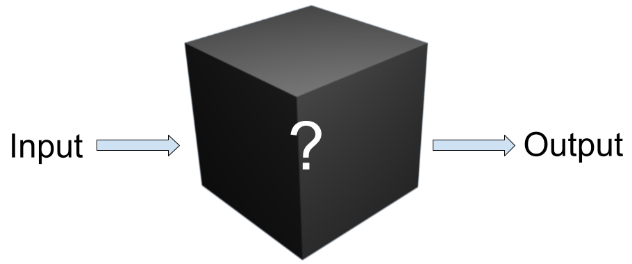

# What kind of techniqniques did we Study?

## All of the Techniques we studied were model-agnostic post hoc local explanations.

Now, for some definitions...

### What does model-agnostic mean?

Usage of a model-agnostic technique does not depend on knowledge of the specific AI model being analyzed. This means that, rather than looking at the specific activations of the network, or the weights and biases, we only have access to the outputs of the model. This may also be described as a black-box approach.

There are a few reasons that this might be desirable. For instance, work done on one model can scale easily to others. With the same techniques in this project, we were able to analyze both [images](/Explainable-Ai-Comps-2024/User%20Study/ResNet%20-%20Comparative%20Results) and [tabular data](/Explainable-Ai-Comps-2024/User%20Study/MOOC%20-%20Comparative%20Results)! Moreover, it allows us to gather insights into models we don't have unrestricted access to. Given that AI model weights are often valuable property that companies have spent much money and time on tuning, they probably won't be willing to share the weights. But model-agnostic techniques only need to be able to query the model repeatedly.

### What is post hoc explanation?

Post hoc explanations attempt to answer, in retrospect, why the model chose the output or classification it did. It's beyond the intended scope of these techniques to predict what the model will say in future instances without testing it on those as well.

### What is local interpretability?

These techniques are not focused on the behavior of the AI model as a whole, but rather on its behavior in a specific instance – one data point. The conclusions, thusly, cannot necessarily be extrapolated too far in any direction.
