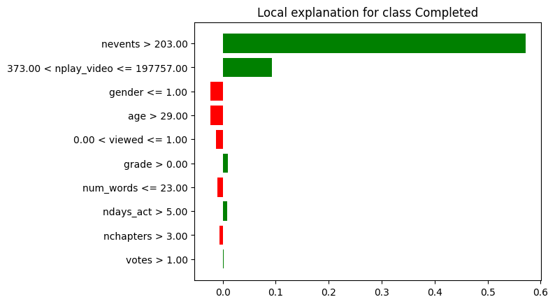

# MOOC Dropout Prediction

## Summary

LIME was trivial to apply to the MOOC Model, provided inelegant but effective explanation visuals, and there appeared to be a positive relation between a viewer's experience with ML and their belief that LIME explanation helped explain the model.

## Apply LIME to MOOCs

Applying LIME to the ML model used to predict if a student would drop out of a MOOC straight forward and did not require a background in explainable AI techniques.

The literature has centralized around one implementation, the Python package [LIME](https://pypi.org/project/lime/), which has extensive and easy to use documentation.

```Python
from lime.lime_tabular import LimeTabularExplainer

# Create LimeTabularExplainer
svm_explainer = LimeTabularExplainer(
    X_train, # training data created by the MOOC src class
    feature_names=[
        'viewed', 'gender','grade','nevents', 'ndays_act',
        'nplay_video', 'nchapters', 'age', 'votes', 'num_words'
    ],
    class_names=['Not Completed','Completed'],
    discretize_continuous=True
)

# Use the explainer to graphically explain predictions
exp = svm_explainer.explain_instance(
    dummy_for_lime, # a fake row of data for LIME to explain
    svc.predict_proba # the black box model's probabilistic prediction method
).show_in_notebook(
    show_table=True,
    show_all=False
)
```

The above code block is a simplified version of [Our Implementation](https://github.com/cosmcbun/Explainable-Ai-Comps-2024/blob/62e136607f3b66106fd09fd558feb38f4834419a/MOOC/LIME/BasicExampleOfUsingLIMEOnMOOCDataset.ipynb) which outputs an explanation similar to the visualization seen below.

## Parsing the Output

### LIME Specific Output


The left third, while created by the LIME package, is not XAI. The visualization simply illustrates the black box model’s prediction which LIME is attempting to explain. The table could be read as “The black box model is 28% confident that the student of interest will not complete the course $\implies$ The black box model is 72% confident that the student of interest will complete the course.”

The right third, displays the feature values of the input which LIME is attempting to explain. LIME believes orange features encourage the black box model to predict that the student will not complete the course. Similarly, LIME explains that blue features pushed the black box model to conclude that the student would not complete the course. The higher in the table the greater the contribution to the final prediction. The first row of this table could be read as “Because the number of events the student of interest has participated in is 32,296, the black box model is more confident that the student will complete the course.”

The center visual displays the relative importance of each feature and why a feature provides a positive or negative contribution to the final prediction. The larger the bars, the more important the feature is in the final decision. Each bar is accompanied with a rule. The rule explains how/why the feature value contributes to the final prediction. The first line could be read as “Because the student of interest has completed more than 203 events, the model is substantially more confident that the student will complete the course.”

### LIME Output used in User Study



This output, while not the default output of the LIME package, is one of the pre-made visualizations available through the package.

- The x-axes represents the probability that the student of interest has completed the course.
- The bars starting at the y-axes represent each features contribution to the black box models prediction.
- If the sum of all bars (where red bars are negative) is greater than 0.5, then the black box model will predict that the student completed the course. Otherwise, the black box model will predict that the student did not complete the course.
- The y-axes labels are rules as to why each feature pushed or pulled the final prediction.

We used this visualization for the user study despite this not being the default visualization from the LIME package because:

1. It was much more visually similar to Shapley.
2. Where the default output provides information unrelated to XAI, this output only outputs novel information resulting from XAI processes.
3. This output helps participants focus on the rules based portion (the y-axis labels) helping connect Anchors’ output to LIME’s.
4. While testing if summing each bar of either visualization is greater than 0.5 can be done, we believe this operation is more intuitive with the second visualization.

## User Study

Consider reading the user study introduction and methodology before continuing

Little can be said about LIME's user study results in isolation. To see how LIME compares to Shapley and Anchors, see the [MOOC Comparative User Study](../User%20Study/MOOC%20-%20Comparative%20Results.md) page.

Across all 5 samples, participants ranked LIME explanation understandability as $\approx4$ on average $\pm 1$.


Across all 5 samples, the greater the participant's experience with ML, the more they believed LIME explanations helped explain the model.


Without a greater sample size, it is difficult to draw any conclusions from this graph. However, it is interesting to note that participants with the least and most experience with ML had the highest confidence that they understood the MOOC model as explained by LIME.
