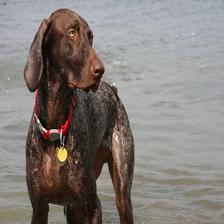
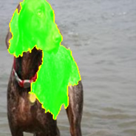

# ResNet

Generating explanations with LIME is fun and all, but in order to generate an explanation, we must first find a model that we can explain in the first place.

Enter [ResNet](https://pytorch.org/hub/pytorch_vision_resnet/) (Residual Neural Network), an architecture trained on the image classification dataset known as [ImageNet](https://www.image-net.org/). ResNet is trained on millions of different images to identify the subjects of a wide range of different classes. For the purpose of our project, we chose to use the pretrained model to focus specifically on identifying pictures of cats and dogs (of which we found several thousand images).

The way LIME works with ResNet is relatively simple: you take an image, resize it to match the specifications (we resized them to be 224x224 squares), transform the image to tensors and normalize. The functions we used to transform the images can be seen below:

```Python
def get_image(path):
    with open(os.path.abspath(path), 'rb') as f:
        with Image.open(f) as img:
            return img.convert('RGB')

# resize and take the center part of image to what our model expects
def get_input_transform():
    normalize = transforms.Normalize(mean=[0.485, 0.456, 0.406],
                                    std=[0.229, 0.224, 0.225])
    transf = transforms.Compose([
        transforms.ToTensor(),
        normalize
    ])

    return transf

def get_input_tensors(img):
    transf = get_input_transform()
    # unsqeeze converts single image to batch of 1
    return transf(img).unsqueeze(0)

# transform/normalize the image
def get_pil_transform():
    transf = transforms.Compose([
        transforms.Resize((256, 256)),
        transforms.CenterCrop(224)
    ])

    return transf

def get_preprocess_transform():
    normalize = transforms.Normalize(mean=[0.485, 0.456, 0.406],
                                    std=[0.229, 0.224, 0.225])
    transf = transforms.Compose([
        transforms.ToTensor(),
        normalize
    ])

    return transf

pill_transf = get_pil_transform()
preprocess_transform = get_preprocess_transform()
```

Here are our [ResNet18](https://pytorch.org/vision/main/models/generated/torchvision.models.resnet18.html) model, which is given the weights of the pretrained dataset, and the predict function:

```Python
# train the model
pretrained_weights = models.ResNet18_Weights.IMAGENET1K_V1
model = models.resnet18(weights=pretrained_weights)

# predict function
def batch_predict(images):
    model.eval()
    batch = torch.stack(tuple(preprocess_transform(i) for i in images), dim=0)

    device = torch.device("cuda" if torch.cuda.is_available() else "cpu")
    model.to(device)
    batch = batch.to(device)

    logits = model(batch)
    probs = F.softmax(logits, dim=1)
    return probs.detach().cpu().numpy()
```

Finally, here is the code we used to train a [LimeImageExplainer()](https://lime-ml.readthedocs.io/en/latest/lime.html?highlight=limeimageexplainer#lime.lime_image.LimeImageExplainer) class, using a 1D numpy array built from the transformed image and the predict function built earlier.

```Python
from lime import lime_image
from skimage.segmentation import mark_boundaries

image_explainer = lime_image.LimeImageExplainer()
image_explanation = image_explainer.explain_instance(np.array(pill_transf(my_image)), # our image converted to the form of a numpy array
                                         batch_predict, # predict function
                                         top_labels=1,
                                         hide_color=0,
                                         num_samples=1000) # size of the neighborhood to learn the linear model

# Apply mask on the image
temp, mask = image_explanation.get_image_and_mask(image_explanation.top_labels[0], positive_only=False, num_features=5, hide_rest=False)
img_boundry = mark_boundaries(temp/255.0, mask)
plt.imshow(img_boundry)
```

Once we have finished training the LimeImageExplainer() model on the image and predict function, which will apply a mask that highlights the parts of the image that contribute to (green) or against (red) ResNet's prediction. The final result can be seen below:




The images above depict a German shorthaired pointer dog, correctly classified as such by ResNet with 0.94 certainty. The post-hoc explanation for this prediction provided by LIME, as seen in the image on the right, highlights the area of interest in green as shown above. In this case, LIME suggests that the model made an accurate prediction by looking at the dog's face and back and determining that it matched the feature values associated with those of a German shorthaird pointer, while ignoring the background (the water). This method is useful because, despite treating ResNet as a black box, we are still able to somewhat extrapolate the mode's thought process and how it came to the conclusion it did.

## Cartons and Vipers and Bears, oh my!

(talk about how LIME can explain some of the wackier ResNet predictions)

## What does this tell us about LIME?

(speak more generally about LIME and how it interacts with the dataset from a critical analysis pov)
