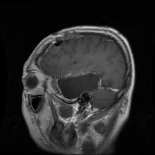
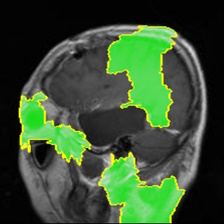
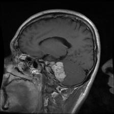
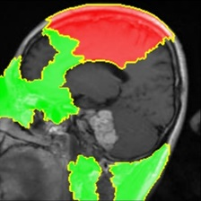
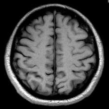
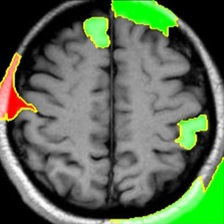
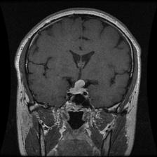
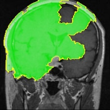

# LIME with the Tumors Dataset

Now that we've seen how LIME works with the Animals dataset, let's show a few examples of how it interacted with our custom-weighted ResNet model, using one randomly-selected image from each class.

### Glioma tumor

### Meningioma tumor

### No tumor

### Pituitary tumor

## Conclusion