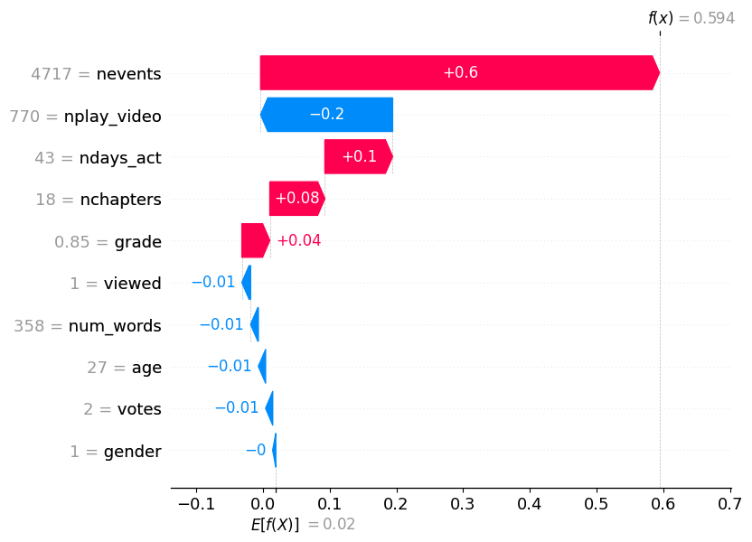

# Shapley and MOOC
This section discusses the application of the ```shap``` package to the Multi-Layer Perceptron that we built for the MOOC dataset.

## The Code
We calculate Shapley values for our dataset via Python's ```shap``` package, a library of functions and classes which encompasses virtually all possible variations upon Lloyd Shapley's original analysis. 

Due to its massive popularity, this package was quite convenient, requiring only a few lines to set up. First, we build our model (see more about our model here) <!-- ! Reference the MOOC page-->
and create an Explainer object for it.
```
import shap
model = MultiLayerPerceptron() # Create our ML model
explainer = shap.explainers.Permutation(model.predict_proba, 
                                          X_train, 
                                          feature_names=feature_names)
```
This is a ```Permutation``` explainer, which builds all possible permutations of feature-value coalitions for the approximation of each Shapley value. The creation of such coalitions mirrors the base technique as outlined in the Shapley's Math page. <!-- !Reference "Shapley's Math" -->
We use our model's ```predict_proba``` function to return real-valued probabilities for the classes "Course Completed" and "Dropped Out," and we pass in our training data ```X_train``` as our data matrix from which our explainer will pull substitute feature values in order to simulate each feature "not participating" in the game of predicton. <!-- !Reference "Simulating not playing"-->

Next, we run our explainer on the datapoints that we want locally explained:
```
shapley_values = explainer(inputs)
```
This returns the Shapley values for each datapoint in the set of ```inputs```, as well as some useful information such as the expected (average) prediction over the set and some useful properties for *Interpretable AI*, which we will briefly cover at the end.

## Explaining a single datapoint
Once we have our ```explanations```, we can visualize the Shapley values for each datapoint. The ```shap``` package contains a plethora of visualization tools for intepretable AI, but for the purposes of our user study and for comparison with LIME and Anchoring techniques, we used the most popular visualization for a single datapoint: the waterfall plot.
```
shap.plots.waterfall(shapley_values[i])
```
This returns a plot of Shapley values for the $i$-th datapoint in the set, like so:

<!--  -->


<!-- </img> -->


<!-- I kinda feel like this should link to a Jupyter notebook -->

## Sections
* Small code snippet to show it off
* Overview of visualizations
  * How this compares to LIME's graphs
* How we use the mask function for SHAP