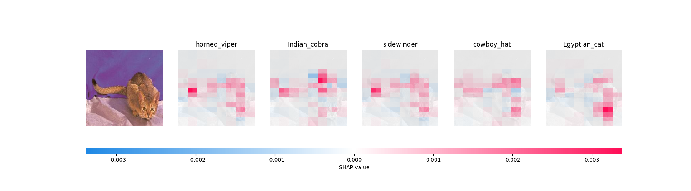

<!-- SOURCES:
    * https://christophm.github.io/interpretable-ml-book/shapley.html
    - https://medium.com/the-modern-scientist/what-is-the-shapley-value-8ca624274d5a
    + https://www.rand.org/content/dam/rand/pubs/papers/2021/P295.pdf
 -->
# Applying Shapley to the ResNet network

This section discusses the application of the ```shap``` package to the standard image-recognition architecture ResNet – both a standard version and a modified one we trained on brain tumor images.

## Code

Despite being very different data from MOOC's, Shapley could interpret its image data in much the same way. For the cats and dogs, for instance, our ```Permutation``` explainer was created as follows:

```Python
import shap
import torchvision.models as models
# Import the model:
pretrained_weights = models.ResNet18_Weights.IMAGENET1K_V1
animal_model = models.resnet18(weights=pretrained_weights)
# Create our explainer:
masker_blur = shap.maskers.Image("blur(128,128)", animal_X[0].shape)
explainer_blur = shap.Explainer(animal_torch_predict, masker_blur, output_names=class_names)
```

The masker is an important part of running Shapley on images. When we produce a coalition of pixels to remain in the image, what do we do with the rest of the picture? We can't remove it, because the network always expects the same dimensions. Neither can we black it out, because sometimes that will resemble something in the image. We opted to blur the rest of the image in this project.

Then, using ```image_blur```, we explain a datapoint of our choice:

```Python
shap_values = explainer_blur(
    animal_picture,
    max_evals=eval_count, batch_size=50, outputs=shap.Explanation.argsort.flip[:top_guesses]
)
```

The most important parameter here is eval_count. The higher the number, the more segments it will split the image into. Because Shapley's runtime is proportional to $2^n$, where $n$ is the number of features, it's possible to spend quite a long time waiting for high-quality explanations. Furthermore, top_guesses here specifies how many of the model's most confident answers you would like predictions for.
With the Shapley values in hand, we can now generate helpful visualizations.

## Visual Explanations




### Required concepts
Cat/Dog
Tumor
  What did Shapley reveal about the tumors dataset
  What interesting results came up
User Study
  What kinds of feedback did we receive?
