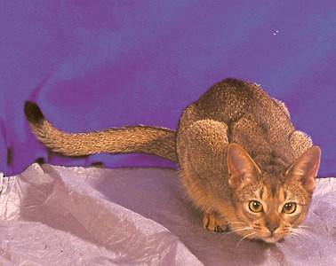
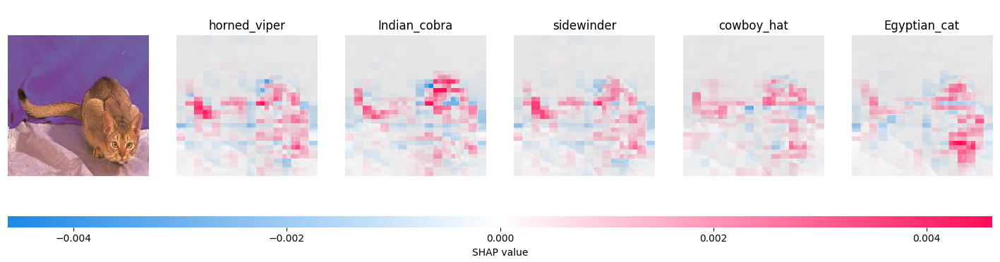
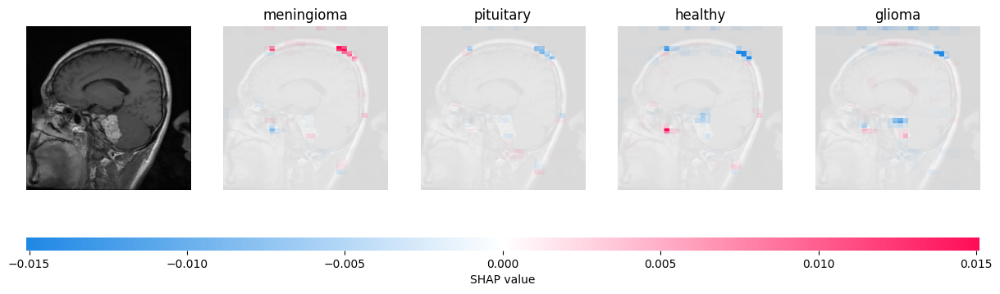

# Applying Shapley to the ResNet network

This section discusses the application of the ```shap``` package to the standard image-recognition architecture ResNet - both a standard version and a modified one we trained on brain tumor images.

## Code

Despite being very different data from MOOC's, Shapley could interpret its image data in much the same way. For the cats and dogs, for instance, our ```Permutation``` explainer was created as follows:

```Python
import shap
import torchvision.models as models
# Import the model:
pretrained_weights = models.ResNet18_Weights.IMAGENET1K_V1
animal_model = models.resnet18(weights=pretrained_weights)
# Create our explainer:
masker_blur = shap.maskers.Image("blur(128,128)", animal_X[0].shape)
explainer_blur = shap.Explainer(animal_torch_predict, masker_blur, output_names=class_names)
```

The masker is an important part of running Shapley on images. When we produce a coalition of pixels to remain in the image, what do we do with the rest of the picture? We can't remove it, because the network always expects images of the same dimensions. Blacking it out is also problematic, because sometimes that will resemble something in the image. We opted to blur the rest of the image in this project.

Then, using ```image_blur```, we explain a datapoint of our choice:

```Python
shap_values = explainer_blur(
    animal_picture,
    max_evals=eval_count, batch_size=50, outputs=shap.Explanation.argsort.flip[:top_guesses]
)
```

The most important parameter here is ```eval_count```. The higher the number, the more features it will split the image into. This is, perhaps, a little strange, because the image already has features: the red, green and blue values for each pixel. Shouldn't we reuse those?

The problem is that Shapley's runtime is proportional to $2^n$, where $n$ is the number of features. If we broke the image down into pixels, then, it'd take far too long to analyze. To this end, then, this Shapley implementation breaks up the image into a grid with regions that are small but are still larger than a pixel. An alternative method - used by [LIME](/Explainable-Ai-Comps-2024/LIME/ResNet) - is to separate the image into a few "superpixel" clumps grouped by pixel color instead of location in image. We decided to use the grid, however, because it was better-integrated with the Shapley package and better showcased its strengths.

The other parameter here, ```top_guesses```, here specifies how many of the model's most confident answers you would like predictions for. Because the model outputs confidence for each of the thousand classes, not just the top, we can create the Shapley visualization for any class.
With the Shapley values in hand, we can now generate helpful visualizations.

## Visual Explanations of Animal Images



The animal above is an Abyssinian cat. ResNet, our neural network, misidentified it as a snake - or perhaps a hat - before a cat. To be specific, its guesses in order were:

- Horned Viper: 0.21
- Indian Cobra: 0.09
- Sidewinder: 0.08
- Cowboy Hat: 0.07
- Egyptian cat: 0.06

Followed by ResNet's 995 other classes, which it deemed less likely than these five. While it's not particularly confident that the subject of the image is a snake, it's certainly held as the most likely outcome. So, we can use Shapley's method to get a picture of why ResNet might have made this mistake.



The visualization produced by Shapley for each prediction is a heatmap. For each region - their number determined by ```eval_count``` - the overlay ranges from red (indicating that the area was instrumental in making the model identify the image as that class) to blue (indicating that it made the machine less likely to pick that class). For instance, on the snake predictions, the end of the tail, face, (and back, somewhat) are highlighted in red. One could imagine that the shape of the tail, especially, suggests snake to the model. On the other hand, the blanket and darker back of the cat are colored in blue, indicating that they were reasons to not call the cat a snake.

## Visual Explantions of MRI scans

In addition to ResNet, we also ran a [model on a dataset of brain scans](/Explainable-Ai-Comps-2024/Methodology/ResNet#tumors). Because Shapley is model-agnostic, minimal changes were required to analyze tumor data as well.



In this case - as with all of the other brain scan predictions we explained - Shapley's picture is far less dynamic. Moreover, the actual tumor (white and slightly below the middle of the picture) is only very slightly highlighted, while an extraneous region at the top of the head is more strongly highlighted. This may point to it being a weaker model that is more reliant on guesswork; undeniably true. While this model got around 60-70% accuracy on our data with four classes, ResNet got 93.8% with a thousand classes. However, it does point to one interesting conclusion the model may have drawn: to look for tumors near the skull. If we were to tune the model, then, we could provide more examples of tumors that were not found at the edge of the brain.
