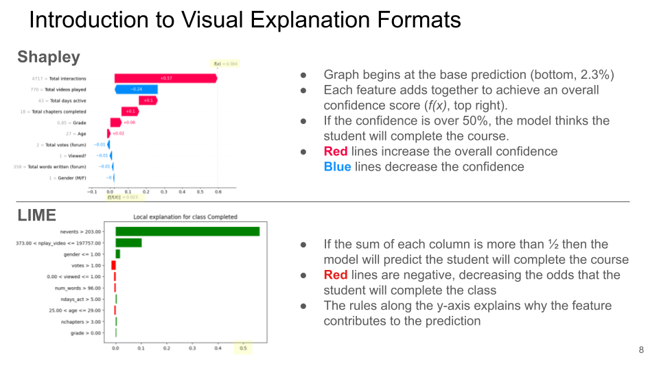

# Limitations

## MOOC Survey Limitations

### Data representations

While the black box model was extremely accurate, the user study displayed a disproportionate number of incorrect predictions to provide more illustrated examples of XAI explanations. This warped participants' perception of the underlying model's effectiveness, and may have influenced their trust and preference for each XAI technique.

Also related to data representations, the user study team had to decide the boundaries between what the XAI technique was explaining and what the particular package used to apply each technique was explaining. For example, The LIME package default output was changed to more closely align with SHAP's output. Many participants complained about the ugliness of the LIME output, these shortcomings were tied to the implementation not the technique, however we did not separate these complaints in the final analysis.

### Small sample size

With only 13 participants, the study was not large enough to draw statistically significant conclusions. Future studies should aim to have a larger sample size to ensure that the results are not due to random chance. However, prior published research used similar sample sizes.

### Introducing XAI Across Experimenters

Central to the study was a participant's ability to understand each XAI technique. Particularly on the MOOC user study, the graphical explanations are not necessarily self-evident (besides Anchor's prose), and each XAI technique answers slightly different questions. In early iterations of the study, experiments observed experimenters' backgrounds influencing how they present each technique, causing different participants to have massively different understandings of each technique. This inconsistency limited the comparability of participants interviewed by different experimenters. To mitigate this in Ribeiro's main study, participants were shown a consistent graphic and text to describe each technique in a consistent form. But to the inherently interview based methods, this shortcoming was not fully mitigated.

## ResNet Survey Limitations

### Data representations

Anchoring, LIME, and Shapley showed their explanations in different ways, which sometimes made it difficult to separate comments about the form of display from comments about the explanations themselves.

- Anchoring displayed the unaltered anchor but blacked out the rest of the image.
- LIME displayed the whole image, highlighting in green the parts it deemed most important to the model.
- Shapley displayed its explanations with a heat map, overlaying the image with blue and red squares whose brightness indicated the importance of the pixel group in the model's decision.

The different data representations all have their pros and cons (Shapley can convey more information by having more values pixel groups can take, but the others tend to be less cluttered and more intuitive explanations), a purer comparison of the techniques could be achieved with matching visualizations.

### Superpixels vs pixel groups

All three explanations techniques need to merge pixels together to be computationally feasible, and in an ideal world the techniques would have used the same condensation algorithms to remove this as a confounding variable. Unfortunately, Shapley splits the image into a grid of squares, while LIME and Anchoring use super pixelation algorithms to group like pixels into shapes. The Anchoring and LIME packages also use different superpixelation algorithms, meaning that they do not have the same set of possible explanations, which would be ideal for evaluating them head to head.
