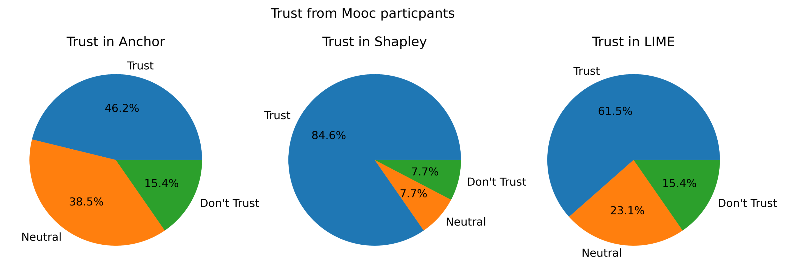
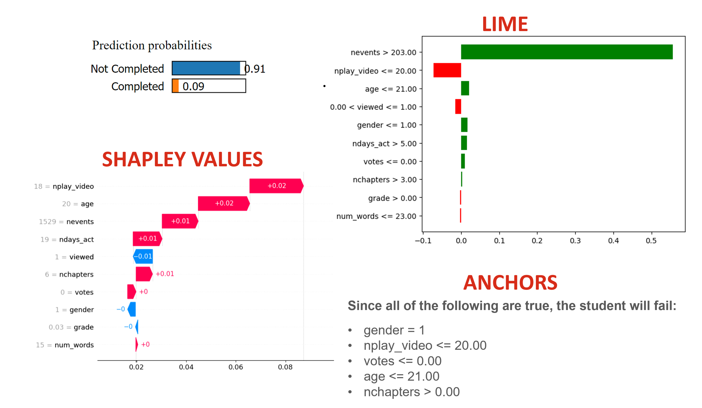

# MOOC: Comparative Results


## "It really breaks down the idea of the black box model."
Most participants felt that any of these techniques sufficiently explained how a model came to its decision. This implies that any of these methods may be effectively employed in accordance with the [EU's GDPR](../Shapley%20Values//The%20EU's%20right%20to%20explainability.md).


These techniques were difficult to explain in such a short time, and a lack of understanding in each of the methods lead to each user heavily weighing visualizations over theoretical basis. This also led many participants to generalize each technique across multiple instances, which while not necessarily problematic, does lessen the effect of each explanation's foundation.


Overall, Shapley values ranked at the top of the users' preferences and trust, followed by LIME, with Anchor tending to be the least preferred.  We also found that the order in which each XAI technique a participant was shown had a significant impact on their preference and perception of the XAI techniques.


## Shapley Values — Math vs. Intuition
Shapley values pulled ahead in our user study by quite a bit: they were most trusted (85\%, 23\% above its nearest competitor), and they were also the favorite technique of 65\% of our users. Moreover, Shapley values accrued an average understandability of 4.17, more than half a point over the other techniques.


Multiple users noted Shapley values' intuition, specifically the additive nature of the ```shap``` package's arrow visuals (as shown in [Shapley and MOOC](../Shapley%20Values/Shapley%20and%20MOOC.md))
> - “Big arrow go right. I like. Sum of big arrows insufficient to allow positive prediction.”
> - "It feels like the method gave me an explanation, and the researcher presenting it didn’t really need to help me.
> - "This makes sense, like the bars moving further and closer. It feels more cumulative"
> - "Shapley had the arrows showing which way, which was very easy to understand."


While Shapley values were visually intuitive, its extensive [mathematical basis](../Shapley%20Values/Shapley's%20Math.md) was almost entirely disregarded. In fact, many users noted that Shapley's math restricted was confusing, and that it restricted the kinds of questions they were able to answer:
> - "I don’t have enough of a base knowledge in the math for Shapley. When you told me the numbers and what represents what, I just was not able to follow."
> - "It’s doing a good job of explaining what happened, but not how it comes to conclusions."
> - "We can’t get the threshold/how much better it gets when there are more plays [nplay_video]. The overall impact is kind of missing here."


Ultimately, the study showed that although Shapley values lend themselves to intuitive visualizations, its math is either disregarded or detrimental to the overall understanding of the technique.
> "With Shapley, I don’t get the math, but I intuitively get it."


Intriguingly, users found Shapley values to be both more understandable and more explainable when the technique explained why a machine learning model was *incorrect* ($3.94\rightarrow4.33$ and $3.54\rightarrow3.66$, respectively). There are many possibilities which may explain this.
-  Firstly, when a model is incorrect, people may be more desperate for an explanation, no matter its source. We see a massive uptick in LIME's understandability as well under these circumstances ($3.25\rightarrow4.13$), which has the lowest understandability in situations where the model is correct. This is potentially refuted by Anchors' scores, which decrease on both fronts when moving from correct to incorrect predictions.
- Secondly, while the ordering of our techniques was randomized, our samples were ordered such that the incorrect results are much more present in the latter half of the survey. This would allow users to become more acquainted with *all* of the techniques, thus leading to higher understandability/explainability across the board. However, LIME's explainability and Anchors' understandability/explainability drop, even with this ordering.
- Thirdly, and most probably, due to the small nature of the study, individual users may have a much higher impact on the average outcomes. One user specifically noted that they were "afraid of extremes," and marked mostly within the 2-4 range instead of reporting 1s or 5s, while another responded predominantly at the poles. Due to the small number of users, such varying survey styles can cause much more variation in the results, leading to pattern hallucination.


## How Technical Expertise Affects User Preference


import BarChart from './src/DoParticipantExperenceAffectRankingsOfXAITechniques.png';


With such a small sample size no strong conclusions can be taken from this chart however there are a host of exploratory conclusions illustrated by this visualization.

1. Shapley Values are the most preferred technique across participants with informal and formal experience with machine learning.
2. LIME is the most preferred technique across participants with no experience with machine learning. However, the difference between rankings from participants with no experience in ML between Shapley and LIME is trivial.
3. Anchors is the least preferred technique across all experience levels.
4. Participants with some experience in ML like Shapley values more than participants with no experience in ML.
5. The more one knows about Machine Learning the less they like Anchors


## LIME — The Middle Ground





In the tabular user study, LIME was consistently in the middle of the pack. This is shown in trust (see above) and rankings. Participants who liked Anchors best ranked LIME second, and those who liked Shapley best ranked LIME second. Why is this? One theory is based on the varying expectations of participants.





Some participants are looking for a set of rules to explain how/why the black box model came to its conclusions. Anchors best fulfill this expectation, and Shapley values do not attempt to meet this expectation, however the y-axis labels of LIME can communicate similar information as Anchors, though much less clearly. Therefore participants who are looking for a set of rules are likely to rank LIME in the middle, and trust LIME more than Shapley but less than Anchors.


Other participants (our user study suggests the majority) look for an intuitive sense of how important specific features are to the black box model's predictions. Shapley values best fulfill this expectation, and Anchors does not attempt to meet this expectation, however the Red and Green bars of LIME can communicate similar information as Shapley, though with less consistency and nuance. Therefore participants who are looking for an intuitive sense of how important specific features are to the black box models predictions are likely to rank LIME in the middle, and trust LIME more than Anchors but less than Shapley.

