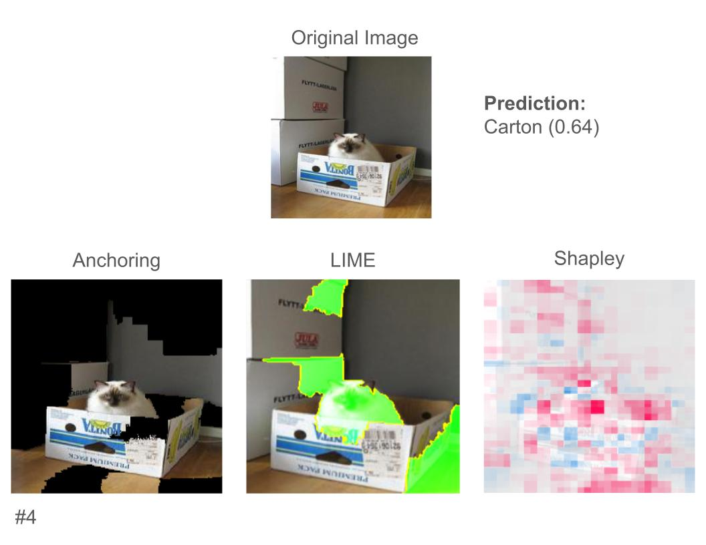
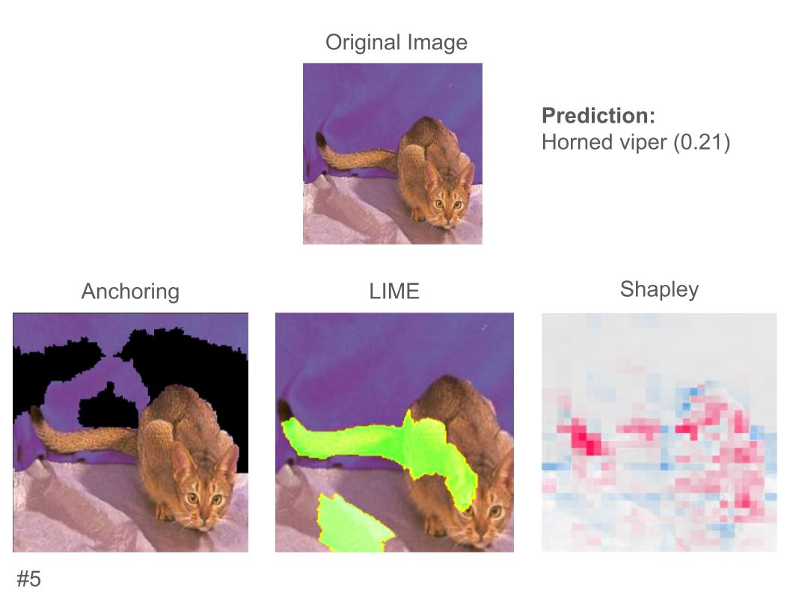
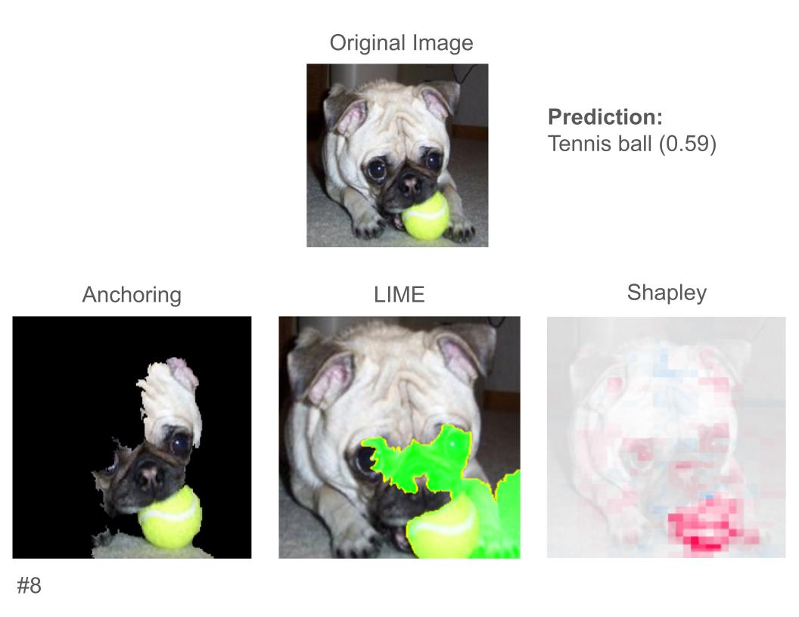
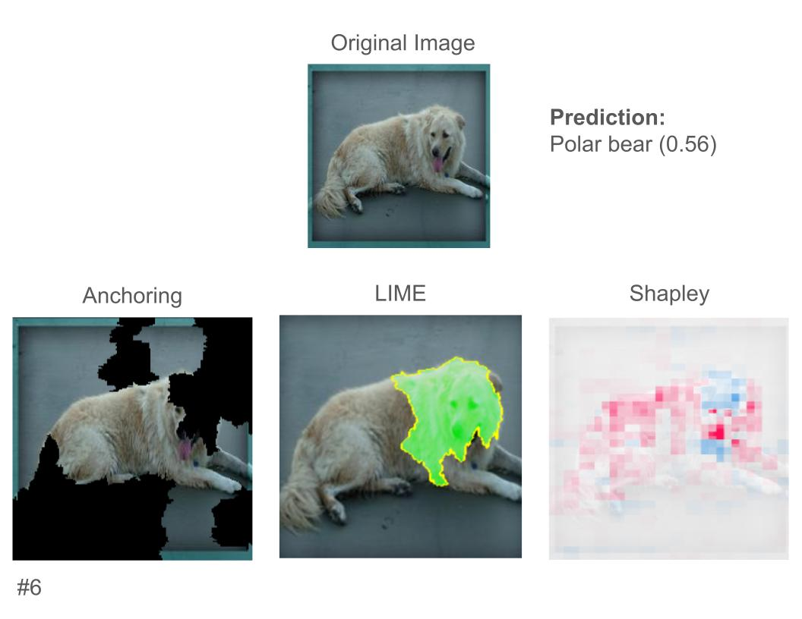

# Resnet: Comparative Results

## TL;DR

- Shapley was the favorite method, especially among participants with more CS experience. LIME was also well-liked

- Explanations that better correlated with what people would've looked at themselves were received better.

- While experience with AI was not strongly correlated with favorite explanations, those with more AI experience were less willing to accept the differences between the explanations without worry.

## Shapley Values
Shapley values, like in MOOC, were numerically ranked as the most trusted method. 8 of our 12 participants said they'd trust it to explain a model's thought process in new examples, as compared to 6 and 4 for LIME and Anchor respectively. Yet the praise of its visualizations was not universal. The heatmaps, at times, could look somewhat random, or cover up the image. As users put it,
> - "Shapley has more specificity, but sacrifices intuitiveness."
> - "If Shapley always had the edge in accuracy I would choose that but anchoring and lime have better display"

Some of this, admittedly, is hard to disentangle from the presentation of the results (as opposed to the techniques).

## LIME
In both surveys, LIME ranked as the second highest technique in terms of both trust and overall preference, beating Anchors but ending behind Shapley. Notably, LIME stood out as the favorite technique for participants who did not have a machine learning background. It received praise for its method of visualization, which isolated the area of interest within a highlighted boundary, making it easy to understand. However, it was also criticized for being somewhat inconsistent depending on the image.
> - "LIME I like the most bc can see what part of the image caused decision with more specificity"
> - "LIME had the biggest failures - like carton - but big successes, like snake."
> - "Visually LIME is compelling"

Overall, it appears participants had a generally positive opinion of this technique.

## Anchoring
Anchoring was seen as the least helpful of the three techniques, with no participants ranking it as their favorite. Occasionally, it performed well relative to the other techniques, like this explanation as to why our model predicted this image as a carton:

Seven participants said this Anchoring explanation improved their understanding of the model, as opposed to two for Shapley and one for LIME, with one participant saying "Anchoring makes more sense in this one because we see the whole carton and less background".

For the most part though, Anchoring was not very illuminating. In both of the following examples, Anchoring was seen as far less effective (at least five less participants saying it improved model understanding than the leading technique)

Participants gave some of the following quotes criticizing anchoring
> - "Anchoring highlights a lot of the pug, which is worrying"
> - "Anchoring is not very helpful because it has almost the whole image highlighted"
> - "Anchoring looked at random stuff in the background that didn't make sense"
> - "It would be nice if anchoring had value"

## Clashing explanations

One phenomenon that confused participants was when the techniques gave contradictory explanations. One example of this is the picture of a dog that the model thought was a polar bear.

LIME focused on the dog's head, whereas Anchoring included most of the dog and much of the background but omitted much of the head, and Shapley highlighted some of the head red and some blue. All explanations are plausible in isolation, but one participant said "If I was given any single one I would say they help, but they confuse in total". After seeing all of the examples, another participant said "it is actively confusing to have different explanations for the same model. If they are seeing the same predictions, they should be showing the same explanation."
